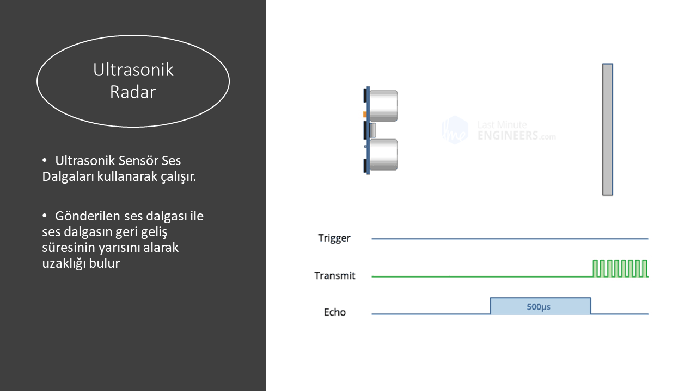

# radar
Arduino, visul studio c# form radar uygulaması

<iframe width="560" height="315" src="https://www.youtube.com/embed/fSM3n66OcfE" frameborder="0" allow="accelerometer; autoplay; encrypted-media; gyroscope; picture-in-picture" allowfullscreen></iframe>

